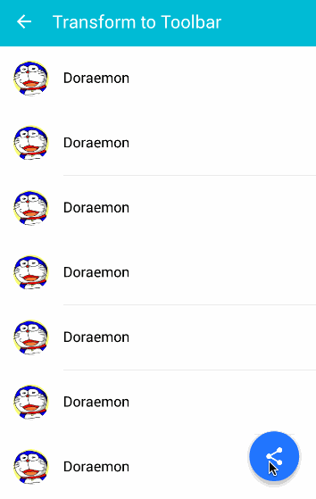

Note: FOR PERSONAL USE ONLY
[](https://github.com/konifar/fab-transformation/blob/master/LICENSE)
[  ](https://bintray.com/konifar/maven/fab-transformation/_latestVersion)

# Fab Transformation
This library supports Floating Action Button transformation in [Material Design Guideline](https://www.google.com/design/spec/components/buttons-floating-action-button.html).

# Screenshot


# Installation
Add the dependency (jcenter) to your `build.gradle`.
```groovy
Step 1. Add the JitPack repository to your build file
allprojects {
		repositories {
			...
			maven { url 'https://jitpack.io' }
		}
	}
Step 2. Add the dependency

	dependencies {
	        implementation 'com.github.mhtparyani:FABTransition:1.0'
	}
```

# How to use
This is footer toolbar transformation example.

## Layout
1. Put Floating Action Button and transform view in your layout.
2. Wrap transform view in Circular reveal container.

```xml
<RelativeLayout
    android:layout_width="match_parent"
    android:layout_height="match_parent">
    
    <!-- Any Fab is OK. (Third party library, your custom view and so on) -->
    <android.support.design.widget.FloatingActionButton
        android:id="@+id/fab"
        style="@style/FabMargin"
        android:layout_width="wrap_content"
        android:layout_height="wrap_content"
        android:layout_alignParentBottom="true"
        android:layout_alignParentRight="true"
        android:src="@drawable/ic_share_white_24dp"
        app:backgroundTint="@color/blue_accent200"
        app:borderWidth="0dp" />

    <!-- You must wrap transform view in Circular reveal container -->
    <io.codetail.widget.RevealFrameLayout
        android:layout_width="match_parent"
        android:layout_height="wrap_content"
        android:layout_alignParentBottom="true">

        <!-- Transform view -->
        <android.support.v7.widget.Toolbar
            android:id="@+id/toolbar_footer"
            android:layout_width="match_parent"
            android:layout_height="@dimen/footer"
            android:background="@color/blue_accent200"
            android:visibility="invisible">
            <!-- Put view you like -->
        </android.support.v7.widget.Toolbar>

    </io.codetail.widget.RevealFrameLayout>
</RelativeLayout>
```

## Java
### Transform fab to other view.
```java

FabTransformation.with(fab)
                 .transformTo(toolbarFooter);
```

### Transform other view to fab.
```java
FabTransformation.with(fab)
                 .transformFrom(toolbarFooter);
```

## Options
```java
FabTransformation.with(fab)
                 .overlay(overlayView)
                 .duration(500)
                 .setListener(new FabTransformation.OnTransformListener() {
                                @Override
                                public void onStartTransform() {
                                    // 
                                }

                                @Override
                                public void onEndTransform() {
                                    //
                                }
                 })
                 .transformFrom(toolbarFooter);
```

# Requirements
Android 2.3+
